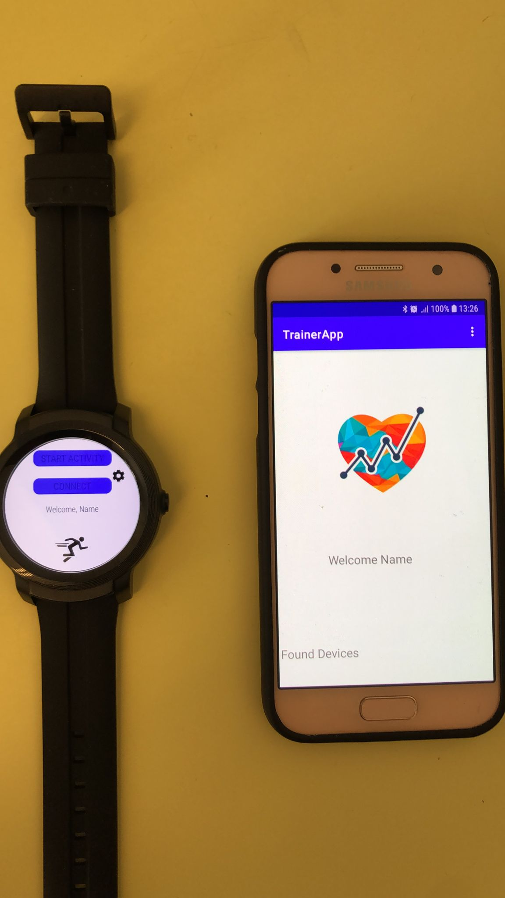
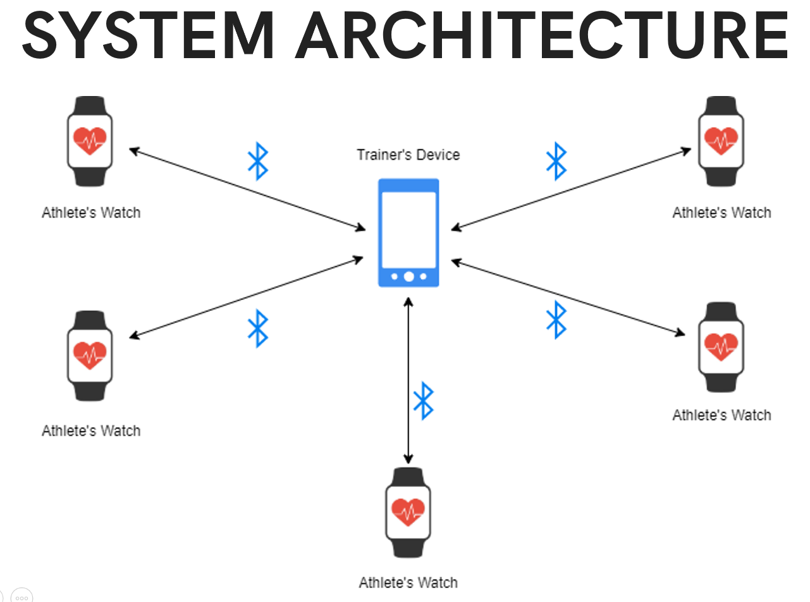
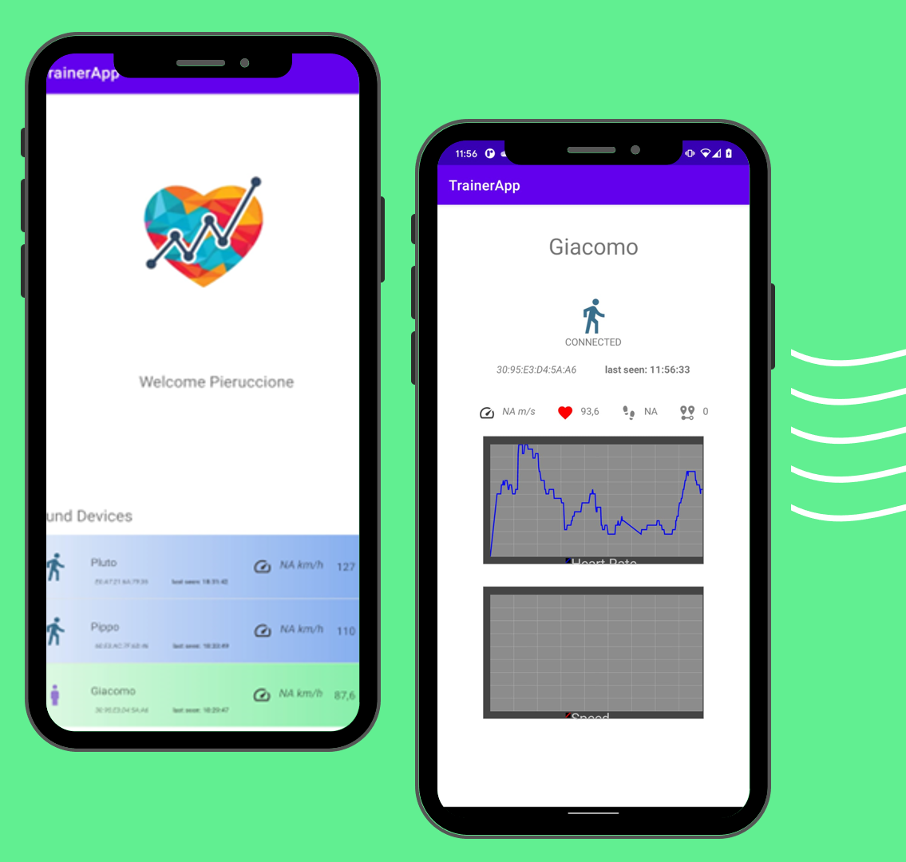

# TrainAround: Monitoring Athletes Workout Using a BLE Star Topology Network

TrainAround is an android app that lets a trainer **control the training status** of a group of athletes.

Existing workout tracking apps **running on smartphones** cannot accurately sense user activities when the phone is placed away from the user, or just become unhandy if they require the phone to be attached to the body.

Our solution runs on wereable devices, that are way less uncomfortable and unhandy and that can more precisely measure training status and are equipped with much more sensors.

We implemented the service in a way that does not need internet connection for the real-time monitoring phase and neither need the watches' paired phones to be connected during the training.

## Hardware Architecture

The athletes should wear a WearOS watch with the TrainAround-client app installed and running, while the trainer can use an android phone or tablet to control the training status of the athletes in real-time.

## Gathered data

- Step Counter (build-in sensor)
- Heart Rate (build-in sensor)
- Speed (using GPS)
- Distance (using GPS)
- Pace (using GPS, defined as $Time \over Distance$)

We also used the Activity Recognition API to determine the state of the athlete that can be:

- Still (no activity recognized)
- Walking
- Running

## Network architecture

Our focus was also on the network to connect the smartwatches to the Coach's Smartphone (central hub). We end-up developing a Bluetooth Low Energy (BLE) Star Topology Network. 

Part of our work involves the choice of this solution comparing it to other alternatives in terms of Compatibility, Versatibility, Simplicity and Energy Efficiency.

## User interface

